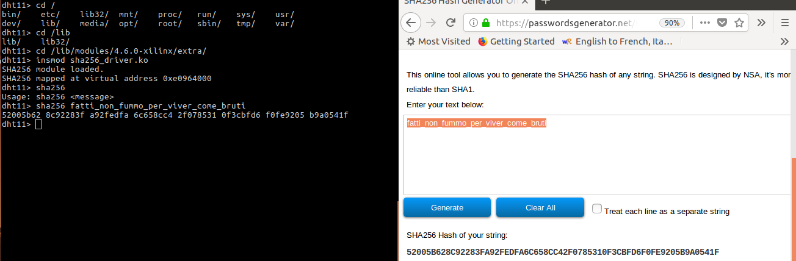

# SHA256 hardware accelerator

* [Architecture](#architecture)
    * [SHA256 XL](#sha256-xl)
    * [AXI interface](#axi-interface)
* [Test 1](#test-1)
* [Synthesis](#synthesis)
* [Test 2](#test-2)
* [Driver and user interface](#driver-and-user-interface)
* [Test 3](#test-3)

## Architecture
The proposed [article](http://soc.eurecom.fr/DS/sec/10.1.1.148.7900.pdf) was used as main reference to realize the architecture of the hardware accelerator. A previous version was conceived beforehand, but was discarded since the proposed architecture seemed really promising in terms of area and performances, thanks to loop unrolling, pipelining and resource scheduling.

Concerning the AXI wrapper, the same design used in a previous laboratory was employed as a starting point. The original design was then expanded in order to implement additional control logic. Please refer to the following sections to have a more detailed overview of the designed VHDL modules.

### SHA256 XL

#### Datapath

[sha256_round.vhd](vhdl/sha256_round.vhd)  

The following picture presents the design of the [datapath](vhdl/sha256_round.vhd) and the relative control signals. The connection of the various registers to the clock signal is not shown to avoid cluttering the picture.

In a nutshell, the designed architecture reproduces exactly what is proposed by the paper. Concerning the registers, we may recognize three main blocks: the variables registers, the delta/initialization registers and the digest message registers. Given the algorithm and the architectural choices, these registers are controlled in three different ways.

The variables registers (named `A` to `H`) contain the temporary values computed during the 64 round computations when processing a single block. During the first round they are loaded with the content of the digest message registers (`DM0` to `DM7`), then they are updated with the values resulting from the processing of the current block. Registers `H`, `E` and `A` behave differently with respect to the others. Resgister `H` can not be reset and can be loaded with `DM7`, `DM6` or with the output of the `F` register, in accordance with the loop unrolling strategy described by the paper.

The `H` register is the only one which cannot be reset, as setting all of its bits to zero serves no purpose. The effect of the `H` register on the rest of the round logic is, in fact, canceled by the `sresetn` signal, as it will be detailed later. The `A` and `E` registers' d inputs don't come from a MUX, as opposed to the other ones. Their inputs are hardwired to the outputs of the adders placed at the ouput of the second pipeline stage, which will be described later. For the time being it suffices to say that these two adders will either output respectively `DM0` and `DM4` or the next value of `A` and `E`, computed according to the SHA-256 algorithm. Lastly, the enables of the `E` and `A` registers are not wired to the signal `alpha_en`, which is the common enable for all the other registers, but they have a different enable signal.

The two 64 bit registers placed in the middle of the pipeline are used to store either the precomputation of δ or the content of `DM0` and `DM4` or the addition of δ and either one of the two. The first case occurs during any normal computation round, the second case occurs before the beginning of a new operation, in order to load `A` and `E` with the initialization value, while the last instance occurs near the end of the processing of a block, in order to add `DM0` and `DM4` respectively to the `A` and the `E` variables computed during the last round. This value represents the new value assumed by the digest message registers `DM0` and `DM4` at the end of a round operation.

The digest message registers are only updated when a block has been processed. The strategy through which this happens has been suggested by the paper: as `B`, `C` and `D` contain values which were previously assumed by `A`, and as the same goes for the registers `F`, `G` and `H` with respect to `E`, the `A` and `E` registers are used to compute the future content of `DM1` to `DM3` and of `DM5` to `DM7`. This is done by employing two adders and two shift registers. The update of these six registers obviously occurs in 3 clock cycles.

In order to understand how this is done, consider the following step by step explaination: during the first round `A` represents the value that `D` will have after 3 rounds. `A` enters an adder which is fed by the content `DM3`, hence the output of the adder will be equal to `D`+`DM3`, i.e. the future value of `DM3`. The shift signal `DM_en` is asserted, hence at the next clock tick the new **DM3** enters the `DM1` register. Now, due to the shift, `DM3` contains the current `DM2` value and `A` contains the value `C` will assume in 2 rounds. On the next rising edge, `DM2`+`C` will enter the `DM1` register and the new **DM3** will be shifted in the `DM2` register. On the 3rd rising edge of the clock, the new **DM1** will be shifted inside the `DM1` register, since `A` contains the value that `B` will assume in the following clock tick and since the other input of the adder comes from `DM3`, which now contains the old **DM1** value. At the following clock tick all the values will be shifted once more, which means that `DM1` to `DM3` will each contain the correct updated value. The same procedure is used to update `DM5` to `DM7`.

The way the `DM0` and `DM4` registers are updated is slightly trickier. During the penultimate computation round, namely when the last δ value is precomputed, `DM0` and `DM4` are added to it, so that in the following round **A** and **E** will contain the values of the last round added to the content of the respective digest message registers, which means that **A** and **E** are now respectively equal to the new **DM0** and **DM4** values. `DM0` and `DM4` have their dedicated enable signals (`DM0_en` and `DM4_en`, which should have been merged into one since they behave identically) since their updaye happens in a different fashion with respect to the other digest message registers. This apparently complex procedure helps us to optimize the area without any performance loss, as only two adders are necessary to update the digest messages without the need of extra clock cycles to update the digest message registers.

As a last note concerning these registers, the reset inputs are connected to different signals. The variable registers are reset by the `alpha_sresetn` signal while the digest message registers use `DM_sresetn` as reset signal. On the other hand, the registers in the middle of the pipeline cannot be reset, as adding this possibility would add no particular benefit. Notice that the `DM` registers are reset to the initial hash values described by the provided [pdf](../doc/sha2.pdf) rather than to 0, as this would serve no purpose. The usage of multiple reset signals is obviously due to the need of resetting the `DM` registers only when a whole message has been processed, while the `alpha` registers need to be reset before beginning the hashing of a new message.

As previously mentioned, the δ value is precomputed, which means that it is computed the round before it will be used. This is done using a circuit which is split by a pipeline stage. The first stage takes as inputs `H`, **K** and **W**. Notice that **K** and **W** assume here the same meaning given in the SHA-256 description pdf. For this reason, K comes from a hardwired ROM while W is either a 32 bit chunk of the message, in which case it is taken from an external register, or is the output of a certain computation performed on 3 of its previous values, as per the SHA-256 standard. These three values are inserted inside a 3 input carry save adder, following the suggestion given by the paper. This allows to speed up the addition by propagating a carry vector as well instead of taking care of the carry at each addition step. The δ sum and carry bits are masked by `alpha_sresetn`, which means that the and gates to which they are connected will halt their propagation if the `alpha_sresetn` signal is not high. This allows to load the following carry save adders with either `DM0` or `DM4` alone, which is necessary when initializing the `A` and `E` registers. Notice that in this case the `DM_sel` signal is low to allow `DM0` and `DM4` enter the carry save adders which have just been mentioned.

The carry and sum outputs of these carry save adders then enter the registers placed in the middle of the pipeline, which basically allows to store the precomputed δ value for the next round. The output of these registers is then fed to two adders having six inputs. The remaining inputs are fed with the values used to compute the new values for `A` and `E`. These values are clearly described in the SHA-256 description pdf, hence they will not be further discussed. Check the schematics for more information concerning the connections and the [sha256\_pkg.vhd](vhdl/sha256_pkg.vhd) file to see how the Maj, Ch, Σ1 and Σ2 operations were translated to VHDL. Notice that these adders were coded in VHDL using simple unsigned addition, leaving complete freedom to Vivado concerning their synthesis. This was done since the Zybo board includes at least two dedicated adders, which are very fast, hence Vivado would most likely use them in order to optimize the clock frequency.

The datapath also contains a shift register containing 16 blocks in order to compute W after the 16th computation, as it is necessary to process some of the previous values in order to obtain the new **W**. This shift register is enabled by the `alpha_en` signal and is reset by `alpha_sresetn`. Lastly, notice the presence of a stall signal, which in fact prevents all the registers from being updated, halting the processing at the current round. This signal has been added in case the message for the current round is not availabe. It will remain asserted as long as the message for the following block is not available.

#### Control Unit

[sha256_cu.vhd](vhdl/sha256_cu.vhd)  

The following picture represents the Moore finite state machine described by the file [sha256\_cu.vhd](vhdl/sha256_cu.vhd) and used to control the datapath which has been described in the previous section. The control unit also includes two counters, one used to update the current round (_nround_) and one used to update the number of processed blocks (_proc_blocks). Notice that, for readability purposes, the presence of a signal name inside a state means that the signal value is high while the machine is in that state.

##### RESET
This state can be reached from any other state when the `sresetn` signal is low. No control signal is high, hence the only asserted signals are `alpha_sresetn` and `DM_sresetn`, active low synchronous resets.

##### IDLE
Idle state: the finite state machine is waiting for the input `nblocks` to be different from 0. This signals represents the number of blocks to be processed. During this state only `DM_sresetn` is high, meaning that the variable registers `A` to `H` are reset.

##### INIT
The SHA-256 hashing operation begins. `alpha_en` and `AE_en` are asserted to allow the variable register to sample the initialization values, fed by the modalities described in the previous section. `DM_sel` is raised in order to change the controlled multiplexer output and stop adding `DM0` and `DM4` to the precomputed δ (refer to the schematics in the previous section). The synchronous low active resets `DM_sresetn` and `alpha_sresetn` are raised, as they will be through most of the following states. The `count_en` signal is raised in order to activate the "nround" counter, which signals the current computation round. These signals will be high through most of the following states, hence they won't be mentioned again unless they switch.

##### HASH0
`alpha_sel` is raised in order to feed the variable registers with the following value instead of the content of the `DM` registers. The FSM will remain in this state until the 15th round has elapsed, after which it will be necessary to use the output of the W block to fed the carry save adder used to precompute δ.

##### HASH1
The W block, which is described in the process labeled _WMUX_ inside the file [sha256\_round.vhd](vhdl/sha256_round.vhd), computes the value that W should assume after the 15th round, in accordance with the SHA-256 standard. As stated above, this value is now used to precompute δ and, for this reason, `loadwi` is now raised. The FSM remains in this state until `nround` reaches the value 61, which means that in the following 4 clock ticks the new values for the digest message registers will be computed.

##### UPDATE0
`DM_en` is raised, which means that the digest message registers begin to shift and hence to update their value following the strategy described in the [datapath](#datapath) section. The next state is UPDATE1.

##### UPDATE1
`DM_sel` is lowered to allow adding `DM0` and `DM4` to the following precomputation of δ, hence preparing the new values for `DM0` and `DM4`. Notice that at this point **DM3** and **DM7** occupy the registers `DM1` and `DM5`. The next state is UPDATE2.

##### UPDATE2
`DM_sel` is raised once again, as it is not necessary to add again the content of the registers `DM0` and `DM4` to δ. The signal `add_block` is raised, hence in the next round the _proc\_blocks_ counter will increase its count, signaling that a new block has been processed. The signal `H_sel` is raised, hence in the next round `H` will be loaded with the content of `DM6`. Notice that at this moment `DM6` really contains the new **DM7**, hence by doing so `H` will contain the initialization value during the next clock period. `loadwi` is not high any longer, as by this point the current block has finished processing and all it remains to be done is to allow the data to reach the proper destination registers. The next state is UPDATE3.

##### UPDATE3
`AE_en` is low in this state, as `A` and `E` respectively contain the new **DM0** and the new **DM4**. With the enable signal being deasserted these registers won't be updated after the next clock tick, which means that in the next round they will contain the initialization value to compute another block. `alpha_sel` is now low in order to allow the loading of the remaining initialization/digest message values inside the variable registers. This has been done in order to allow the seamless processing of blocks, should the number of blocks be larger than one. `DM_en` is low, since the digest message registers from 1 to 3 and from 5 to 7 contain the new values and don't need to shift again. `DM0_en` and `DM4_en` are raised to allow the respective digest message registers to be updated with the new values after the next clock tick. At this point we can either go to the IDLE state or to the HASH0 state, based on the number of blocks yet to be processed. The control is performed by comparing the _proc\_blocks_ counter with the input signal `nblocks`, defining the total number of blocks to be processed.

#### HASH_COMPLETE
If the number of processed blocks equals the total number of blocks, the `done` signal is raised, signaling the readiness of the SHA-256 message digest. The sresetn signals are lowered in order to reset all the registers and prepare the datapath to process a new message.

### AXI Interface

[sha256_ctrl_axi.vhd](vhdl/sha256_ctrl_axi.vhd)

The datapath and the finite state machine described in the previous section are capable, together, of computing a hash, but they need a superstructure which feeds them with control signals and messages chunks. This superstructure needs also to communicate with the exterior world in order to retrieve the message to be hashed. Since in this case the external world is represented by the ARM processor mounted on the FPGA, an AXI interface is necessary, just like the ones used in the previous laboratories. The VHDL code previously realized has been modified and expanded on in order to adapt it to the current needs.

There is no need to rediscuss how the AXI wrapper was realized and verified - in case of interest please refer to the [20180423 report](../20180423/REPORT.md). The new version contains 9 read only registers and 128 read and write registers. The first ones are mapped from offset 0x00 to offset 0x20 while the remaining registers are mapped from offset 0x24 to offset 0x1fc. The first eight registers contain the value of the last computed hash (H0 to H7). The ninth register is a status register which is also used for debugging purposes. Its least significant bit is raised if the `done` signal is high on the rising edge of a clock. The following six bits contain the number of message chunk writes since the last hash computation (`nwrites`). The following six bits contain the current round of the hash function (`nround`). The following six bits contain the number of blocks to be processed (`nblocks`). The following bit is the `stall` signal and the remaining 12 bits represent the first 12 bits of the content of `DM0`. None of these bits are actually used by the control logic but the first one - future versions of this hardware accelerator should envision a better usage of the remaining 31 status bits.

The next two registers (0x24 and 0x28) are the first read/write registers. The first one is used to store the number of blocks to be processed. When a value different from zero is loaded inside it a new hasing procedure begins. The following register was thought to store additional control bits, however it was not used and hence it serves no purpose in the current version. The input messages have to be stored from the register mapped at offset 0x2c and on. Everytime a new message chunk is written inside a register the counter _data\_cnt_ is incremented. This value is compared with `nrounds`, the output of the counter which represents the number of the current round to be processed by the SHA-256 accelerator. If the number of processed messages is equal to the number of written messages minus one, the `stall` signal is asserted, with the consequence of stalling the current hasihng operation, as explained in the previous section.

The `stall` signal will be deasserted once a new message chunk has been stored, i.e. when the data dependency for the current round has been solved. The `stall` signal is forced to one if no message chunk has been written yet. On the other hand, it is forced to zero if the current round number is bigger than 15 or if the number of writes is equal or larger than the total number of message chunks which should be processed. When weighing these information notice that the _nround_ counter wraps at 64, hence it will be possible to stall again the SHA-256 accelerator at the beginning of each block. Consider also that the total number of message chunks to be processed comes from the register mapped at offset 0x24, since it suffices to multiply the number of blocks to be processed by 16 to obtain the total number of 32 bit message chunks to be processed.

The _M\_select_ process takes care of sending the proper message chunk to the input of the SHA-256 accelerator. The control logic assumes that the message chunks are stored one after the other, starting at offset 0x2c. Therefore, the message chunk which is fed to the accelerator is located at the offset given by 11 + `nround` + `cblock`*16, with the latter signal representing the index of the current block being processed (this signal comes directly from a counter inside the accelerator, as previousl described). Notice that, if we're dealing with a little endian architecture, the order of the bytes of each message chunk has to be reversed before being sent to the accelerator. The reason is that the convention adopted by the SHA-256 standard is that the last byte of each chunk must occupy the least significant position. If the architecture is of the little endian type, such in this case, the message will be ordered in memory with characters occupying increasingly higher memory locations. Therefore, in a 4 byte block the character which has been obtained first will occupy the least significant position, while the last byte will occupy the most significant one.

When the `done` signal rises all the read write registers are reset, as well as the _data\_cnt_ counter. This, besides cleaning the internal memory, preventing the risk of using previously stored message chunks to compute a new hash, allows the internal logic to halt the hashing process when the final digest message has been computed, as the hashing process would not stop since the IDLE state would step to the INIT state due to the presence of a value other than zero in the 0x20 register. Even though this module has been successfully validated it is worth to notice several issues. First of all, an improper selection of the write data address will cause the _data\_cnt_ counter to increment, but if the data has been stored in the improper position the message chunk might be processed out of order or not be processed at all, if it has been stored in a location which won't be accessed. This issue can be avoided by refining the control logic or by imposing the constraint of having to write in sequence from register 0x2c to the ending address to the firmware programmers. As previously stated, register 0x28 is unused and the status register at 0x20 could be thought over, as the way it is now is mostly useful for debuging purposes. Lastly, the number of read write registers has been arbitrarily set to 128 but a more accurate analysis can lead to a better suited sizing of the memory size, e.g. finding out where will the SHA-256 accelerator be employed, for which type of data, which is the processor controlling it, etc. Lastly, it would be better to realize an additional Moore finite state machine controlling the whole start/stall/stop procedure instead of having to rely on several processes as in the current version.

## Test 1
 [tb_round.vhd](vhdl/tb_round.vhd)  
 [tb_axi.vhd](vhdl/tb_axi.vhd)  
 [tb_total.vhd](vhdl/)

The VHDL modules described above were tested using ModelSim and appropriate testbenches. The first testbench was used to verify the correct functionality of the SHA-256 accelerator, the second one verified the AXI wrapper, while the last one verified the correct functionality of both modules together. After a trial and error procedure, which was more lengthy for the validation of the SHA-256 accelerator, the design proved functionally correct.

## Synthesis
[sha256_ctrl_axi.syn.tcl](scripts/sha256_ctrl_axi.syn.tcl)

After having verified the formal correctness of the VHDL files the whole project was synthesized using Vivado. The .tcl script used for this purpose is an adaptation of the previously used ones. The following subsections contain tables extracted from the various log files produced during the synthesis process.

### FSM state encoding

|                  State |                     New Encoding |                Previous Encoding |
|------------------------|----------------------------------|----------------------------------|
|                  reset |                             0000 |                             0000 |
|                   idle |                             0001 |                             0001 |
|                   init |                             0010 |                             0010 |
|                  hash0 |                             0011 |                             0011 |
|                  hash1 |                             0100 |                             0100 |
|                update0 |                             0101 |                             0101 |
|                update1 |                             0110 |                             0110 |
|                update2 |                             0111 |                             0111 |
|                update3 |                             1000 |                             1000 |
|          hash_complete |                             1001 |                             1001 |

The FSM state encoding performed by the synthesis tool is pretty standard. A more power conscious approach would have been to make sure that the hamming distance between two successive states would be as small as possible, e.g. encoding hash1 with 0111, update1 with 1101, update2 with 1100, update 3 with 1110 and hash_complete with 1010.

### RTL Component Statistics

|Adders  |                |              |
|--------|----------------|--------------|
| 6 Input|     32 Bit     |  Adders := 2 |    
| 2 Input|     32 Bit     |  Adders := 2 |    
| 4 Input|     32 Bit     |  Adders := 1 |    
| 2 Input|     13 Bit     |  Adders := 1 |    
| 2 Input|      7 Bit     |  Adders := 1 |

|Registers     |             |
|-------------|----------------|
| 32 Bit      |  Registers := 174|   
|  7 Bit      |  Registers := 1  |   
|  3 Bit      |  Registers := 2  |

As expected, the two six input adders used to produced the new `A` and `E` have clearly been synthesized using dedicated adders. The other dedicated adders could be used for many other reasons, e.g. to compute the data address. It is not clear whether the carry save adders have been synthesized using some of the dedicated adders listed above or using PLBs, since they have been coded following a structural approach.

### ROM

|Module Name  | RTL Object | Depth x Width | Implemented As | 
|-------------|------------|---------------|----------------|
|sha256_round | K[0]       | 64x32         | LUT            | 
|sha256_round | K[0]       | 64x32         | LUT            | 

It is interesting to notice that the K array has been actually synthesized resorting to a ROM - or at least to the FPGA equivalent of a ROM.

### Report Instance Areas

|      |Instance                  |Module          |Cells |
|------|--------------------------|----------------|------|
|1     |top                       |                | 12301|
|2     |  U0                      |sha256_ctrl_axi | 12278|
|3     |    sha256cu              |sha256_cu       |  5681|
|4     |      sha256round         |sha256_round    |  4513|
|5     |        adder2A           |adder6          |   235|
|6     |        adder2E           |adder6_0        |    19|
|7     |        \gen_shr[12].shr  |regNbit         |    32|
|8     |        \gen_shr[13].shr  |regNbit_1       |    32|
|9     |        \gen_shr[14].shr  |regNbit_2       |   149|
|10    |        \gen_shr[1].shr   |regNbit_3       |   282|
|11    |        \gen_shr[4].shr   |regNbit_4       |    32|
|12    |        \gen_shr[5].shr   |regNbit_5       |    32|
|13    |        \gen_shr[6].shr   |regNbit_6       |    32|
|14    |        shr0              |regNbit_7       |  2066|
|15    |        shr15             |regNbit_8       |    32|

|          Site Type         | Used | Fixed | Available | Util% |
|----------------------------|------|-------|-----------|-------|
| Slice LUTs                 | 4895 |     0 |     17600 | 27.81 |
|   LUT as Logic             | 4777 |     0 |     17600 | 27.14 |
|   LUT as Memory            |  118 |     0 |      6000 |  1.97 |
|     LUT as Distributed RAM |    0 |     0 |           |       |
|     LUT as Shift Register  |  118 |     0 |           |       |
| Slice Registers            | 5817 |     0 |     35200 | 16.53 |
|   Register as Flip Flop    | 5817 |     0 |     35200 | 16.53 |
|   Register as Latch        |    0 |     0 |     35200 |  0.00 |
| F7 Muxes                   | 1088 |     0 |      8800 | 12.36 |
| F8 Muxes                   |  512 |     0 |      4400 | 11.64 |

It is interesting to notice that the adder used to precompute δ does not figure among the instances, and also that the first register in the shift register chain used to record **W** is particularly burdensome in terms of area. From the second table it is evinced that no latches have been synthesized, as expected, since every combinatorial process always had an else statement. 

### Clock

|Clock     |    Waveform(ns) |    Period(ns) |    Frequency(MHz)|
|-----     |   ------------  |   ----------  |  --------------  |
|clk_fpga_0|  {0.000 5.000}  |    10.000     |    100.000       |  

|      | Failing endpoints    | Worst Slack | Total violation |
|:-----|----------------------|-------------|-----------------|
|Setup |        0             |  0.341ns    |        0.000ns  |             
|Hold  |        0             |   0.036ns   |        0.000ns  | 
|PW    |        0             |  4.020ns    |    0.000ns      | 

| Analysis  | Data  |
|-------------|----------------------------------------------------|
| Slack (MET) |             0.341ns  (required time - arrival time)|
| Source      |             top_i/ps7/inst/PS7_i/MAXIGP0ACLK       |
| Destination |            top_i/sha256_ctrl_axi/U0/data_reg_reg[19][20]/D|
| Path Group  |             clk_fpga_0|
| Path Type   |           Setup (Max at Slow Process Corner) |
| Requirement |            10.000ns  (clk_fpga_0 rise@10.000ns - clk_fpga_0 rise@0.000ns) |
| Data Path Delay |        9.230ns  (logic 1.450ns (15.710%)  route 7.780ns (84.290%)) |
| Logic Levels |           0 | 
| Clock Path Skew |        -0.214ns (DCD - SCD + CPR)|
|   Destination Clock Delay (DCD)|    2.743ns = ( 12.743 - 10.000 ) |
|   Source Clock Delay      (SCD)|    3.073ns |
|   Clock Pessimism Removal (CPR)|    0.116ns |
| Clock Uncertainty |      0.154ns  ((TSJ^2 + TIJ^2)^1/2 + DJ) / 2 + PE |
|   Total System Jitter     (TSJ)|    0.071ns |
|   Total Input Jitter      (TIJ)|    0.300ns |
|   Discrete Jitter          (DJ)|    0.000ns |
|   Phase Error              (PE)|    0.000ns |

The clock analysys shows that the design could respect the imposed clock constrain of a 100 MHz clock. Since there is still some slack available, the clock frequency could probably be increased even further without hindering the functionality of the circuit.

## Test 2

The bitstream produced at the end of the synthesis process was loaded on the Zybo board in order to test the overall architecture using `devmem`, as done in a previous laboratory. This test was successful as well, as the first eight registers would contain the correct output digest message at the end of a hashing cycle. Also, the read only memory bounds were correctly enforced by the AXI control module, as well as the size of the read/write memory section, i.e., trying to write or read an invalid memory location would cause the AXI wrapper to signal an error. The hashing procedure would start only after having loaded the register at offset 0x24 with a number different than 0 and all the writeable registers would be reset at the end of the computation. Even the pipeline stalling worked correctly, as the result would not be stored inside the first eight registers until all the message chunks would have been loaded inside the appropriate memory location. As expected, however, loading data in incorrect memory locations would still increase the count of the successful writes, with a wrong hash being produced as a result. For the time being, as previously stated, the only way to mitigate this problem is to make sure that the firmware writes in the proper memory locations.

## Driver and user interface 

[sha256_driver.c](C/sha256_driver.c)  
[sha256.c](C/sha256.c)

The procedure described by the previous laboratory was followed in order to be able to generate all the necessary files to interface the SHA256 accelerator with a Linux operating system. The driver was only slightly modified with respect to the one used to communicate with the DHT11 controller. The read function is now capable of reading only 32 bits at a time. The same goes with the writing function, which is the only functionality which has actually been added to the original driver. This constraint on the data size has been enforced by performing a check on count: if count is not four, i.e. if the number of bytes to be written is not 4, the driver will return an error. Both functions use the f_pos parameter to point to a specific memory location when reading or writing. The driver designed in a former version would perform more complex operations, such as writing a whole message inside the SHA-256 AXI wrapper registers. However, since it has been pointed out that a driver should always be as simple and fast as possible, the current version has been used instead. Any instance were the name "dht11" was previously used were changed to "sha256". This was particularly important for the compatibility string, as its name depends on the name of the top module. This will let the Linux kernel associate the driver to the designed peripheral.

A companion user interface was realized. It is a simple commandline program which accepts as unique input a message and returns as output the computed hash. The developed C source code is rather simple and straight forward. The program makes sure that the SHA-256 driver is installed. Then, it applies the padding to the input message. It was chosen to perform the padding using a software rather than in the hardware world since the latter approach would have been more complex with no really significant improvement in terms of performances. The number of blocks which must be used is computed beforehand by summing the number of bits of the message to 1 (bit to append at the end of the message) + 64 (the number of bits used to store the message length) + 512 (the result has to be at least 1). Then, an integer division is performed between the result and 512. This information is mostly important when it comes to obtain the number of 0s to append before writing the message length at the end of the last block. Then, the message is written to the proper registers (i.e. incrementing the address by 4 at any successive write). Then, the first status bit of the SHA-256 XL peripheral is polled until it's equal to one, signaling that the unit has finished processing the message. The resulting hash is then read from the peripheral, by reading the appropriate registers, and the result is printed on screen.

## Test 3

First, a debug version of the user interface was tested on a laptop. It read and write data to local file. The result of the test were as expected but for the order of the bytes of the padded message chunks, which was reversed in each of the 32 bytes simulated registers. This issue was previously described in the [AXI interface](#axi-interface) section, which also includes how it was solved. The necessary files were uploaded to the board. Picocom was used to establish a communication with the operating system on the processor of the board. The generated kernel module was loaded and the user interface was tested by hashing several messages. The resulting hash was compared with the result given by an online [SHA-256 hash generator](https://passwordsgenerator.net/sha256-hash-generator/). Since they always matched, the test was considered successful.

